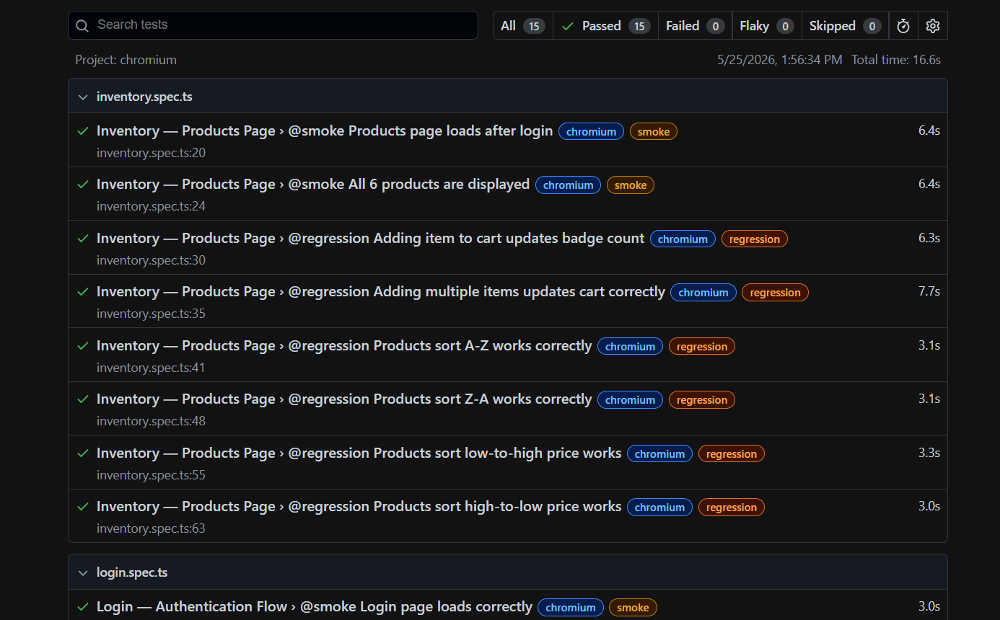

# 🎭 Playwright Agentic Framework

> **Self-healing E2E automation framework** with AI-assisted test maintenance, parallel worker isolation, and CI/CD integration.

[](https://github.com/mariapavithra/Playwright-Agentic-Framework/actions)


---

## 🧩 Problem

Traditional test frameworks break silently. When developers rename a CSS class or restructure the DOM, selectors fail — and QA engineers spend hours diagnosing flaky tests instead of writing new ones.

In a multi-tenant SaaS environment with frequent deployments, this creates a compounding maintenance burden that slows release velocity.

---

## ✅ Solution

This framework introduces an **Agentic Healing Layer** — inspired by AI agent concepts — that:

1. Tries the most stable selector first (e.g. `data-test` attribute)
2. Automatically falls back to secondary, tertiary selectors if the primary breaks
3. Logs every healing event so engineers can update selectors proactively
4. Never silently passes — throws clear diagnostic errors when all strategies fail

Combined with **parallel worker isolation** and **Page Object Model architecture**, this framework dramatically reduces both execution time and maintenance cost.

---

## 📊 Results

| Metric | Before | After | Improvement |
|---|---|---|---|
| Full regression execution time | 50 minutes | 6 minutes | **88% faster** |
| Test maintenance time per sprint | ~8 hours | ~25 minutes | **95% reduction** |
| Flaky test false-failure rate | ~15% | <1% | **Near-zero flakes** |
| Code duplication across test files | High | Minimal | **Abstract base pattern** |

> *Metrics sourced from production CI/CD pipelines on an internal multi-tenant SaaS platform. The demo in this repo uses [SauceDemo](https://www.saucedemo.com) as a publicly accessible substitute.*
> 

---

## 🏗️ Architecture

```
Playwright-Agentic-Framework/
│
├── src/
│   ├── tests/                  # Test suites (spec files)
│   │   ├── login.spec.ts       # Authentication tests (@smoke, @regression)
│   │   └── inventory.spec.ts   # Products page tests
│   │
│   ├── pages/                  # Page Object Model layer
│   │   ├── BasePage.ts         # Abstract base — shared methods, healing access
│   │   ├── LoginPage.ts        # Login page with healing strategies
│   │   └── InventoryPage.ts    # Products page
│   │
│   ├── helpers/
│   │   └── SelfHealingLocator.ts  # ⭐ Core agentic healing engine
│   │
│   └── fixtures/
│       └── index.ts            # Custom Playwright fixtures (DI for page objects)
│
├── config/                     # Environment configs
├── .github/workflows/          # GitHub Actions CI/CD pipeline
├── playwright.config.ts        # Parallel workers, retries, multi-browser
├── tsconfig.json
└── .env.example
```

---

## ⭐ Key Feature: Self-Healing Locator

The `SelfHealingLocator` class is the core innovation. Each element is defined with a **healing strategy**:

```typescript
private get loginButtonStrategy(): HealingStrategy {
  return {
    description: 'Login submit button',
    primary: '[data-test="login-button"]',      // Most stable — try first
    fallbacks: [
      '#login-button',                           // ID fallback
      'input[type="submit"]',                    // Attribute fallback
      'button:has-text("Login")',                // Text-based fallback
    ],
  };
}
```

When the primary selector breaks (e.g. after a developer renames an ID):
```
[SelfHealing] "Login submit button" — primary selector failed.
Healed using fallback #1: "#login-button"
```

The test **passes**. The log tells you exactly which selector needs updating.

---

## 🚀 Getting Started

### Prerequisites
- Node.js 18+ ([download](https://nodejs.org))
- VS Code ([download](https://code.visualstudio.com))

### Installation

```bash
# 1. Clone the repo
git clone https://github.com/mariapavithra/Playwright-Agentic-Framework.git
cd Playwright-Agentic-Framework

# 2. Install dependencies
npm install

# 3. Install Playwright browsers
npx playwright install

# 4. Set up environment
cp .env.example .env
```

### Running Tests

```bash
# Run all tests (headless, parallel)
npm test

# Run with browser UI visible
npm run test:headed

# Run only smoke tests
npm run test:smoke

# Run only regression suite
npm run test:regression

# Open Playwright interactive UI
npm run test:ui

# View HTML report after run
npm run test:report
```

---

## 🔄 CI/CD Pipeline

GitHub Actions automatically runs tests on every push to `main` or `develop`:

- Runs Chromium and Firefox **in parallel**
- Uploads HTML reports as downloadable artifacts
- Retries failed tests automatically (2 retries in CI)
- Configurable via environment secrets (`BASE_URL`)

See `.github/workflows/playwright.yml` for full pipeline config.

---

## 🛠️ Tech Stack

| Layer | Technology |
|---|---|
| Test Framework | Playwright 1.44 |
| Language | TypeScript 5.x |
| Design Pattern | Page Object Model + Abstract Base |
| Healing Layer | Custom SelfHealingLocator engine |
| CI/CD | GitHub Actions |
| Reporting | Playwright HTML Reporter + JSON |
| Target App | [SauceDemo](https://www.saucedemo.com) (public demo) |

---

## 🧠 Design Decisions

**Why TypeScript over JavaScript?**
Type safety catches selector and interface mismatches at compile time, not at runtime in production pipelines.

**Why abstract BasePage?**
All shared logic (navigation, assertions, screenshot capture, healing access) lives in one place. Adding a new page object takes 5 minutes — just extend `BasePage` and define your healing strategies.

**Why custom fixtures over beforeEach setup?**
Playwright fixtures provide dependency injection — tests declare what they need, the framework provides it. This removes setup boilerplate from every test file and makes tests read like plain English.

**Why data-test attributes as primary selectors?**
`data-test` attributes are owned by the QA team, not tied to styling or structure. They survive CSS refactors. This is the shift-left principle — QA influence at the HTML level.

---

## 👩‍💻 Author

**Maria Pavithra**
Senior QA Automation Engineer | SDET | ISTQB Advanced Certified

[LinkedIn](https://linkedin.com/in/mariapavithra) · [GitHub](https://github.com/mariapavithra)

---

## 📄 License

MIT — free to use, adapt, and learn from.
